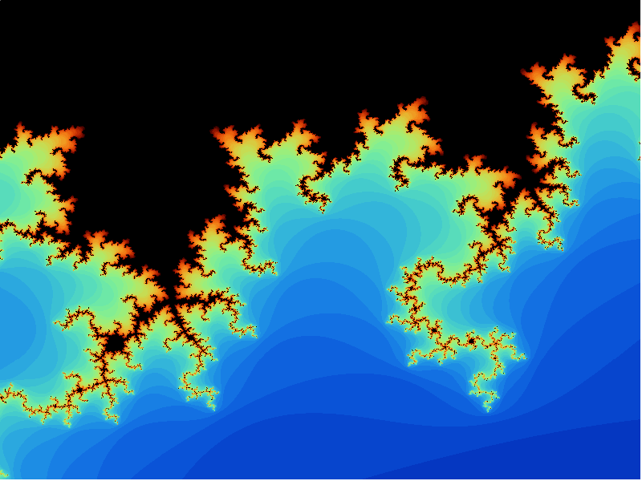
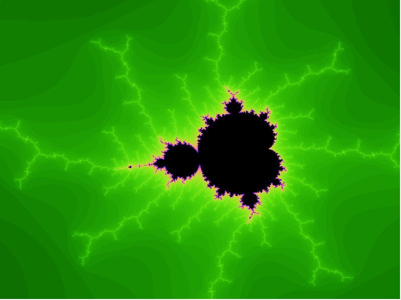

# Mandelbrot Renderer

This is a (keyboard and mouse) interactive C++ renderer of the Mandelbrot set, using SDL2 for output.
The main thread maintains an array of pixel data in memory. A pool of rendering
threads are passed messages containing a reference to this pixel data and some bounds,
and compute new colour values for the pixels within those bounds as the user provides
new inputs for zoom level, iterations, and so on.

Realistically this parallelises so well only because each pixel value is truly independent
from all the other pixels -- so this work really belongs in a GPU shader rather than
on the CPU. It's fun to see how large the speedup from multithreading can be when the work
truly is parallelisable, though!

## Obligatory action shots

## Command-line flags

The program supports the following command line flags:

- `-h` / `--help`: prints help message and exits
- `-wx` / `--screen-width`: sets the image width in pixels
- `-hx` / `--screen-height`: sets the image height in pixels
- `-c` / `--concurrency`: set number of render threads. Default is the number of cpu cores, so
one thread per core.

## Viewer controls:

### Mouse

Click + drag to draw a rectangle to zoom into it.

### Keyboard

- <kbd>space</kbd> -- take screenshot (screenshots are saved to `screenshot-<n>.bmp` in the current directory) (inc. trashy screen flash effect)
- <kbd>r</kbd> -- reset viewer
- <kbd>c</kbd> -- cycle colour scheme
- <kbd>+</kbd>/<kbd>=</kbd> -- zoom in
- <kbd>-</kbd> -- zoom out
- <kbd>.</kbd> -- increase detail (iterations)
- <kbd>,</kbd> -- decrease detail (iterations)
- <kbd>↑</kbd>, <kbd>←</kbd>, <kbd>↓</kbd>, <kbd>→</kbd> -- pan image
- <kbd>ESC</kbd> -- quit

## Dependencies for Running Locally
* cmake >= 3.7
  * All OSes: [click here for installation instructions](https://cmake.org/install/)
* make >= 4.1 (Linux, Mac), 3.81 (Windows)
  * Linux: make is installed by default on most Linux distros
  * Mac: [install Xcode command line tools to get make](https://developer.apple.com/xcode/features/)
  * Windows: [Click here for installation instructions](http://gnuwin32.sourceforge.net/packages/make.htm)
* SDL2 >= 2.0
  * Installation instructions can be found [here](https://wiki.libsdl.org/Installation)
  * Note that for Linux, an `apt` or `apt-get` installation is preferred to building from source.
* gcc/g++ >= 5.4
  * Linux: gcc / g++ is installed by default on most Linux distros
  * Mac: same deal as make - [install Xcode command line tools](https://developer.apple.com/xcode/features/)
  * Windows: recommend using [MinGW](http://www.mingw.org/)

## Basic Build Instructions

1. Clone this repo.
2. Make a build directory in the top level directory: `mkdir build && cd build`
3. Compile: `cmake .. && make`
4. Run it: `./Mandelbrot`.

